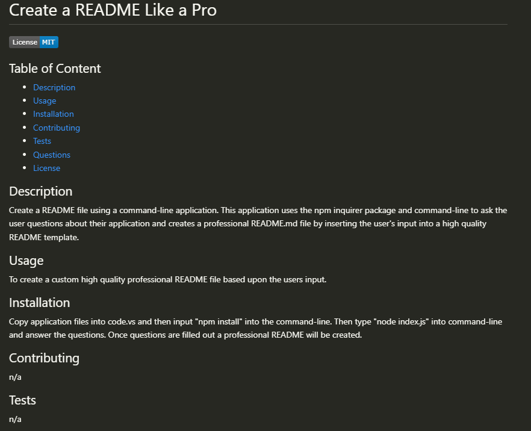

# Create a README Like a Pro

)

## Table of Content
  - [Description](#Description)
  - [Usage](#Usage)
  - [Installation](#Installation)
  - [Contributing](#Contributing)
  - [Tests](#Tests)
  - [Questions](#Questions)
  - [License](#License)

## Description
  Create a README file using a command-line application. This application uses the npm inquirer package and command-line to ask the user questions about their application and creates a professional README.md file by inserting the user's input into a high quality README template.

## Usage
  To create a custom high quality professional README file based upon the users input.  
  
  

## Installation
  Copy application files into code.vs and then input "npm install" into the command-line. Then type "node index.js" into command-line and answer the questions. Once questions are filled out a professional README will be created.

## Contributing
  n/a

## Tests
  n/a

## Questions
  https://github.com/Chiweenie6  

## License
  MIT License

Copyright (c) [2023] [Kevin Breedlove]

Permission is hereby granted, free of charge, to any person obtaining a copy
of this software and associated documentation files (the "Software"), to deal
in the Software without restriction, including without limitation the rights
to use, copy, modify, merge, publish, distribute, sublicense, and/or sell
copies of the Software, and to permit persons to whom the Software is
furnished to do so, subject to the following conditions:

The above copyright notice and this permission notice shall be included in all
copies or substantial portions of the Software.

THE SOFTWARE IS PROVIDED "AS IS", WITHOUT WARRANTY OF ANY KIND, EXPRESS OR
IMPLIED, INCLUDING BUT NOT LIMITED TO THE WARRANTIES OF MERCHANTABILITY,
FITNESS FOR A PARTICULAR PURPOSE AND NONINFRINGEMENT. IN NO EVENT SHALL THE
AUTHORS OR COPYRIGHT HOLDERS BE LIABLE FOR ANY CLAIM, DAMAGES OR OTHER
LIABILITY, WHETHER IN AN ACTION OF CONTRACT, TORT OR OTHERWISE, ARISING FROM,
OUT OF OR IN CONNECTION WITH THE SOFTWARE OR THE USE OR OTHER DEALINGS IN THE
SOFTWARE.
