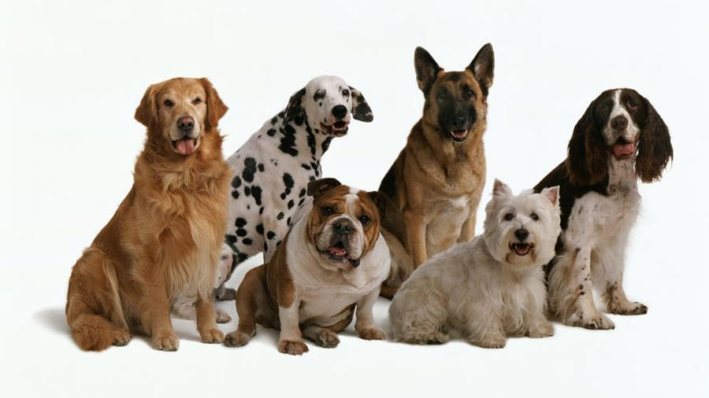

# Dogs

)

## Table of Content
  - [Description](#Description)
  - [Usage](#Usage)
  - [Installation](#Installation)
  - [Contributing](#Contributing)
  - [Tests](#Tests)
  - [Questions](#Questions)
  - [License](#License)

## Description
  Pictures of dogs

## Usage
  Enjoy looking at the pictures.  
  Image:   
  

## Installation
  Type "npm i" into the terminal window.

## Contributing
  n/a

## Tests
  n/a

## Questions
  Click https://github.com/dogs6 to view my GitHub profile.  
  Click dogs006@gmail.com to send me an email.

## License
  [MIT](https://choosealicense.com/licenses/mit/) license, click link to view license.
